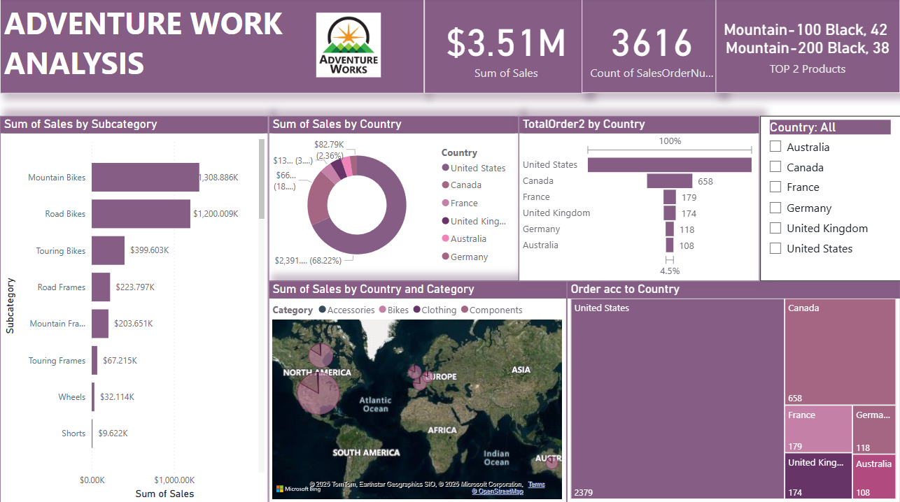

# Adventure-Work-Analysis-Dashboard
# 🔍 Project Summary
This repository features a fully interactive and insights-driven Power BI dashboard built using the AdventureWorks dataset. The project demonstrates a strong grasp of Power BI's visual analytics, DAX measures, and business intelligence storytelling.

The goal of this dashboard is to analyze sales performance, evaluate target achievements, and identify country-level and category-level trends using intuitive visuals and forecast models.

# 📌 Dashboard Objectives & Features
1. Sales by Subcategory – Stacked Bar Chart
   
     (a) Displays a segmented view of total sales by product subcategories.
 
     (b) Ideal for spotting top-selling and underperforming subcategories.

2. Sales by Country – Donut Chart

     (a) A clean circular breakdown of sales contribution by each country.

     (b) Quickly shows which markets lead in revenue.

3. Total Orders by Country – Funnel Chart

     (a) Visualizes the number of orders per country in a descending funnel format.

     (b) Helps identify order volume disparities among countries.

4. Sales by Country & Category – Map Chart

      (a) Interactive map illustrating total sales figures by region and product category.

      (b) Great for regional performance comparison.

5. Orders by Country – Tree Map

      (a) Visual hierarchy of countries based on order volume.

      (b) Useful for understanding order distribution at a glance.

6. Sales vs Target Sales – Gauge Chart

      (a) Real-time comparison of actual sales to target sales.

      (b) Clearly shows performance status toward achieving targets.

7. Target Sales Only – Gauge Chart

      (a) Focused visualization for target sales benchmarks.

      (b) Helps set context for goal alignment and strategy planning.

8. Sales Trend by Year/Quarter/Month – Line Chart with Forecasting

      (a) Displays sales data over time with built-in forecasting enabled.

      (b) Projects future sales based on historical trends using Power BI’s analytics engine.

10. Orders Trend by Time – Area Chart with Trendline

      (a) Illustrates how orders change over time, highlighting seasonal trends or demand shifts.

       (b) Enhanced with trendlines to interpret overall patterns.

# 📁 File Details
* File Name: measuresPractice.pbix

* Tool Used: Power BI Desktop

* Dataset Used: AdventureWorksData.xlsx

* Data Model: Cleaned and structured using Power Query

* Custom Measures: Created using DAX for dynamic calculation of sales, targets, and time intelligence

* Forecasting: Enabled on time-series charts for predictive insights

# 🧠 Skills & Concepts Demonstrated
* DAX Measures & Calculated Columns

* Power BI Visuals: Stacked Bar, Donut, Funnel, Gauge, Map, Tree Map, Line, Area

* Time Intelligence (Year, Quarter, Month breakdown)

* Data Modeling & Relationships

* Forecasting using Power BI Analytics

* User-centric Dashboard Design

# 🚀 How to Use This Dashboard
1. Open the measuresPractice.pbix file using Power BI Desktop.

2. Refresh the data source (if needed).

3. Interact with slicers, filters, and tooltips to explore KPIs and performance insights.

4. Observe trends and predictions to support strategic decision-making.

# 📈 Business Use Case
This dashboard is best suited for:

* Sales Managers tracking revenue and order performance.

* Executives monitoring KPIs and target achievements.

* Data Analysts interpreting product and country-level trends.

* Marketing Teams identifying high-performing regions and forecasting future growth.

# 📌 Future Enhancements
* Add dynamic slicers for category and region filters

* Implement drill-through pages for country-level performance

* Integrate profitability and discount metrics

* Include customer segmentation and lifetime value analytics

# 📚 References & Learning
* Power BI Official Docs

* DAX Guide

* AdventureWorks Dataset 

# 📎 Project Preview (Screenshots)

